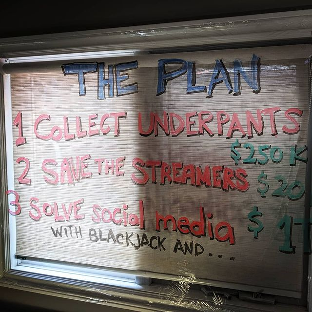

# LGTM: Shipit

A podcast about programming by programmers for programmers. Big ideas, inspirational technologies, interviews with leading programmers, their thoughts on working in the industry, and the insights they've picked up along the way.

## Good things happen for communities

// TODO: explicitly state the good things this podcast might be able to do for others.
//       note - episode 1 will hopefully cover a lot of the good things

## Hosting

**podcast central distribution**: <https://anchor.fm/lgtm-shipit>  
**Podcast RSS**: <https://anchor.fm/s/523f7c4c/podcast/rss>  
**youtube (video version + livestreams)**: <https://www.youtube.com/channel/UC84NrXG8k4vwZanuLilgvxQ>  
**twitch (livestreams only)**: <https://www.twitch.tv/alexchesser>  

## Social / Contact

**linkedin**: <https://www.linkedin.com/in/alex-chesser/>  
**twitter**: <https://twitter.com/AlexC04>  
**email**: `alexchesser at gmail dot com`  

## Interview Preparation

[Read the article](Articles/interview-prep.md)

## Episodes

### [Episode 0 - Shipit](Episodes/Episode0.md)

I did not initially intend to share this video. It was initially a workflow and camera test to make sure I had the production process working. Lighting, framing, audio, set dressing, script, delivery, there are a *LOT* of variables in producing a single video.

I spent hours and came up with something that despite my efforts managed to put the "M" in MVP! I was planning on showing it to a few of my early interviewees to gater feedback, but the next day I came across [this comment on hackernews](https://news.ycombinator.com/item?id=26533837) which resonated with what I'd been feeling and had *just last night* had posted a video on.

Within a few hours I gained about a hundred subscribers in youtube, a few dozen comments saying things like "good work" and "I'm looking forward to your next episode". Friends and strangers were giving me great advice and action items to improve the quality for the next one.

One user had the generosity to comment on some of the issues I've opened for keeping track of all the things that need to be done.

It's been so energising, empowering and, validating that there might just be a viable product here. It redoubled my resolve to push forward "at least one more episode" and fills me with a very heady mix of pride and obligation.

Friends and strangers took the time to speak up and say kind things. I am so greatful to them. I cannot wait to prove worthy of that participation.

## Upcoming Episodes - things to look forward to

### Episode 1: The Plan

One of the things I'm learning right off the get go is that finding time to conduct an interview is challenging when you have a full time job and a two year old son. Between the two of them, that's the hours from 7am to 7pm fully allocated. Add chores to that (laundry, groceries, household administration) suddenly the hours available to progress on the project on run from about 8pm to midnight and the time between 5am and whenever the boy wakes up.

Far easier and far more achievable is to accomplish hobby-goals in the minutes between all the other things that have to happen first. How do you ensure that you remain present for the people that need you when you're consumed by the need to create? After I put my son down for his nap today, I knew I had a random amount of time between 45 minutes and 2 hours. I went to the basement studio to hopefully move the line forward just a little bit. As much as I can achieve in the time I have. Just one goal.

It makes me want to take a moment to consider the ways to scale the content production pipeline in a way that is realistic within the time I have available. The answer I'm going to experiment with is trimming out the script writing process and editing at least, sort of, I'm actually going to try a workflow where I deliver a semi improvised piece, direct to camera on a live stream. "We'll do it live"

I'm going to write the bullet points and maybe make a PowerPoint, but instead of spending the hours meticulously crafting every word I say, spending the hours on just one more take, spending the hours in windows movie maker dilligently muting or cutting the "ummmmmm", rather than spending the hours not putting it out there ... I'm going to do it live. Just put it out there. I'm going to ship it.

There were so many wonderful and valuable comments from the HN thread, do more of this, do less of that. They're all correct. At the same time, I don't have to evaluate myself against iJustine, Jenna Marbles, or, Linus Tech Tips after the end of my first episode. Ship it, gather feedback, improve, iterate. The best part? By writing, producing and shipping the script in real time (maybe under a separate label like "lgtm: shipit raw" (shipit sushi? Whatever, it can be workshopped) anything that is worth re-recording with higher production value can be.

I've had "the business plan" bouncing around in a vaguely unordered list in my head. The next episode will tell the story of how this could go from nothing, through a $250k lifestyle business all the way up to a trillion dollar software project. I think it will be fun, clever, thought provoking. It is entirely crazy and I assure you, not entirely serious. The intention will be to make you think exponentially to think "what happens if?" ... To spark a conversation and maybe trade out the thoughts that are worth following up on.

As a sign that I'm taking on (dad's) feedback about adding some depth to the background, here's a photo of the set-design of the next episode, I had to run out and buy the dry erase markers so I could write on the winter-insulation-plastic that is covering my office windows. I really hope that people find this as funny, entertaining and thought provoking as I do.

### Episode (X - in development) - Look at me! I'm medicare for all now

It was 3AM when I woke up in the middle of the night about the "next phase" in digital healthcare delivery. I heard recently about some pretty exciting initiatives that are happening in the healthcare delivery space. Like, things that are going to be so powerful that whoever does achieve "end state" first will very likely become the winner-take-most of the US healthcare market and potentially capture a large portion of the global healthcare delivery market.

I don't know how long this episode will take to build out, becasue I really would like to get an interview in the mix, but I think it's too exciting not to share. The product *if executed correctly* will allow improved delivery of healthcare with a lower overhead and provides opens new revenue streams. With improved margins in healthcare and capturing a greater percentage of total cost of healthcare delivery, you have a strategic advantage to lowering your prices-for-coverage. It's the whole we'll give you gmail for free, because we can make money in other places if you're with us" argument.

If you can reduce the cost of coverage in the US you can get more people their health insurance. You directly save lives. I think it is a really exciting look at where healthcare delivery is going to be, probably in the next 5 years. I'll be pointing to public domain information regarding the disparate parts of the offering that already exist and how the winner in this space will lego-brick them together into a grand-unification-theory of healthcare delivery.

To be very clear here, since I actually work at a digital agency who focuses on the healthcare industry, it is **VERY** important to note that I heard this information 100% outside of my day job and in no way would be violating any privileged client information. I don't want to get fired over fears that I'm flapping my gums on youtube over this cool super secret project I'm working on. Although I don't actually know if the stuff I've heard is public information yet either, so I've also got to double check that bit too.

## Interview Nominations

As the podcast progresses, I will inevitably run out of my own personal network of developers to interview. I'm hoping to start gathering community input right away. If you know a developer who you think would make a great interview candidate **OR** if you are a community member who thinks you would be willing to tell me about yourself, please open a new issue with the label "interview-proposal".

In the interview proposal, please take a moment to say something nice about them. What makes you admire them? What makes you think they'd be an interesting subject? If you have a *public* method of contacting them, please post. Do not post private contact information.

There aren't any hard rules about who constitutes interesting but in the first round, I want to focus on developers with 10+ years experience, those who've shown exceptional leadership and, developers from traditionally under-represented demographics and diverse backgrounds.

People with perspectives! People with stories.

## Podcast Sponsors

If you would like to discuss supporting the podcast, please reach out via the contact options above.

Some options to consider:

* endorsement / paid promotion: 15 or 30 second mention embedded within the podcast "this podcast is brought to you by `<your name/business here>`  
* listing in the repo readme: a bulleted list within the `special thanks` section of this readme (reach out and contact me if you would like to be the first to make me create that special thanks section).  
